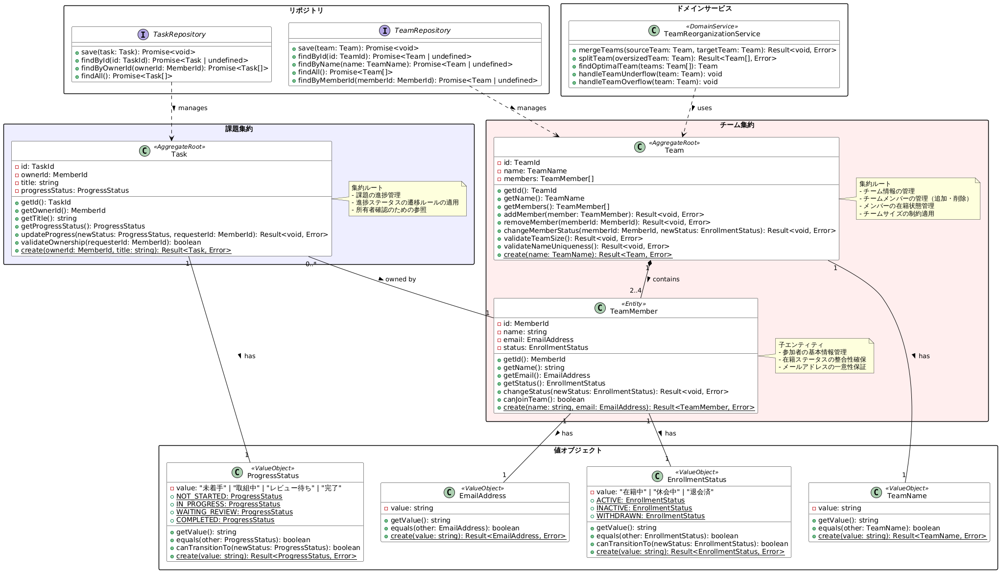
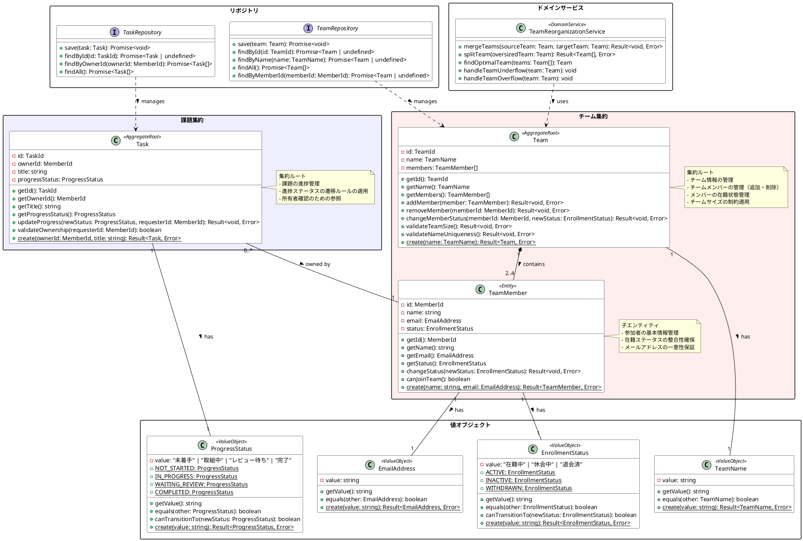

# プラハチャレンジDDDのドメインモデル図



## PlantUML



## ドメインモデルの説明

### 集約の設計

このドメインモデルでは、systemPatterns.mdに記載されている通り、2つの主要な集約を定義しています：

1. **チーム集約**
   - 集約ルート: `Team`
   - エンティティ: `TeamMember`（参加者情報）
   - 値オブジェクト: `TeamName`, `EmailAddress`, `EnrollmentStatus`
   - 責務:
     - チーム情報の管理
     - チームメンバーの管理（追加・削除）
     - メンバーの在籍状態管理
     - チームサイズの制約適用

2. **課題集約**
   - 集約ルート: `Task`
   - 値オブジェクト: `ProgressStatus`
   - 責務:
     - 課題の進捗管理
     - 進捗ステータスの遷移ルールの適用
     - 所有者確認のための参照

### 値オブジェクト

1. **EmailAddress**
   - メールアドレスの検証と値の保持
   - 不変性と値に基づく同一性を持つ

2. **EnrollmentStatus**
   - 在籍状態（在籍中、休会中、退会済）の管理
   - 状態遷移のルールを持つ

3. **ProgressStatus**
   - 課題の進捗状態（未着手、取組中、レビュー待ち、完了）の管理
   - 状態遷移のルールを持つ

4. **TeamName**
   - チーム名の検証（英文字のみ）と値の保持
   - 不変性と値に基づく同一性を持つ

### ドメインサービス

**TeamReorganizationService**
- 複雑なチーム統合アルゴリズムの実装
- 複雑なチーム分割アルゴリズムの実装
- チームの過不足発生時の再編ロジック
- 最適なチーム配属先の決定アルゴリズム

### ドメインイベント

チーム集約から発行されるイベント:
- **TeamCreatedEvent**: チーム作成時
- **MemberAddedEvent**: メンバー追加時
- **MemberRemovedEvent**: メンバー削除時
- **MemberStatusChangedEvent**: メンバーの在籍状態変更時
- **TeamUndersizedEvent**: チームサイズが2名未満になった時
- **TeamOversizedEvent**: チームサイズが4名を超えた時

課題集約から発行されるイベント:
- **TaskCreatedEvent**: 課題作成時
- **TaskProgressUpdatedEvent**: 課題進捗更新時
- **TaskCompletedEvent**: 課題完了時

### 集約間の関係と協調

1. **メンバーの在籍状態変更時**:
   ```
   チーム集約（TeamMember） → MemberStatusChangedEvent → 
   アプリケーション層のポリシー → 必要に応じてチーム再編サービス
   ```

2. **課題進捗更新時**:
   ```
   課題集約 → チーム集約（所有者確認） → 
   TaskProgressUpdatedEvent
   ```

3. **チーム再編時**:
   ```
   チーム集約 → TeamUndersizedEvent/TeamOversizedEvent → 
   アプリケーション層のポリシー → チーム再編サービス
   ```

## ドメインモデルの特徴

1. **集約の適切な設計**
   - systemPatterns.mdに記載された2つの集約に基づく設計
   - TeamMemberをチーム集約内の子エンティティとして位置づけ
   - 集約間の参照はIDのみを使用

2. **ドメインイベントによる疎結合**
   - 集約間の直接依存を避け、イベントを通じて連携
   - 変更の影響範囲を限定し、拡張性を向上

3. **値オブジェクトの活用**
   - ドメイン概念を型として表現
   - バリデーションと不変性の確保

4. **ドメインサービスの適切な配置**
   - 複雑なビジネスロジックを集約から分離
   - 集約間の調整を担当

このドメインモデルは、systemPatterns.mdに記載された集約構造に基づき、DDDの原則に従いながら、プラハチャレンジの仕様を満たすように設計されています。ドメインイベントとドメインサービスを活用することで、複雑なビジネスルールを表現しつつ、保守性と拡張性を確保しています。
