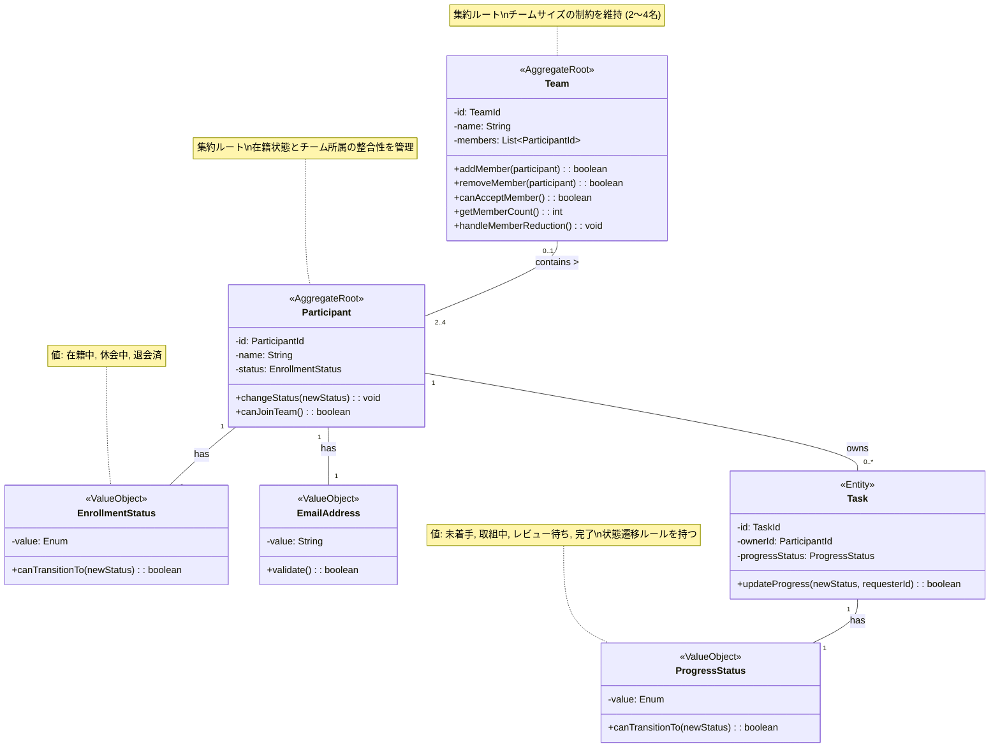

<think>ユーザーがmermaid.jsを使用したドメインモデル図を希望しています。前のUML形式の図をmermaid.js形式に変換しましょう。mermaid.jsでクラス図を作成するには、classDiagramシンタックスを使用します。

ドメインモデル図には以下の要素が必要です：
1. エンティティ（Participant, Team, Task）
2. 値オブジェクト（EnrollmentStatus, ProgressStatus, EmailAddress）
3. 集約境界の表現
4. 関連性

mermaid.jsでの表現では、集約の境界を視覚的に表すのが少し難しいですが、クラス間の関係性と注釈でできるだけ明確にします。</think># Mermaid.jsによるドメインモデル図

Mermaid.jsを使用したドメインモデル図を作成します。この図では、エンティティ、値オブジェクト、およびそれらの関係性を表現します。

## 図の解説

この図では以下の要素を表現しています：

1. **値オブジェクト**
   - `EnrollmentStatus` - 参加者の在籍状態を表す不変オブジェクト
   - `ProgressStatus` - 課題の進捗状態を表す不変オブジェクト
   - `EmailAddress` - メールアドレスを表す不変オブジェクト

2. **エンティティと集約ルート**
   - `Participant` - 集約ルート。参加者を表すエンティティ
   - `Task` - 参加者集約に属する課題エンティティ
   - `Team` - 集約ルート。チームを表すエンティティ

3. **関連性**
   - 参加者は1つのメールアドレスと在籍状態を持つ
   - 参加者は0個以上の課題を所有する
   - チームは2〜4名の参加者を含む
   - 参加者は最大1つのチームに所属できる

4. **注釈**
   - 各クラスの役割や制約についての補足説明

## 図の限界と補足

Mermaid.jsはUMLの全機能をサポートしていないため、集約境界を明示的に囲む表現ができませんが、集約ルートであることを示す注釈と`<<AggregateRoot>>`のステレオタイプで表現しています。

この図は静的な構造を示すものであり、前の議論の通り以下の点を別のドキュメントで補完する必要があります：

1. 詳細な制約やポリシー
2. 複雑な業務ルール（チーム再編アルゴリズムなど）
3. ステータス遷移のルール
4. 各集約内の一貫性確保メカニズム

次に作成すべきドキュメントとして「ドメインルールと振る舞い仕様書」をお勧めします。
