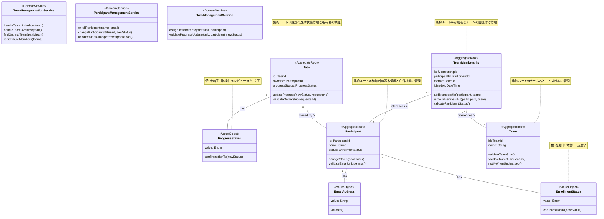

## 質問

```
これ以上集約は細かく分けられないのでしょうか
```

## 解答

<think>私は、さらに細分化した集約パターンのMermaid.jsダイアグラムを作成します。先ほど説明した4つの集約を表現します：
1. 参加者集約
2. 課題集約
3. チーム集約
4. チームメンバーシップ集約

Mermaid.jsの制限を考慮しながら、集約境界、エンティティ、値オブジェクト、およびそれらの関係を明確に表現します。</think># 細分化された集約パターンのMermaid.js図



## 集約の説明

### 1. 参加者集約 (Participant Aggregate)
- **集約ルート**: Participant
- **責務**:
  - 参加者の基本情報管理
  - 在籍ステータスの整合性確保
  - メールアドレスの一意性保証

### 2. 課題集約 (Task Aggregate)
- **集約ルート**: Task
- **責務**:
  - 課題の進捗管理
  - 進捗ステータスの遷移ルールの適用
  - 所有者確認のための参照

### 3. チーム集約 (Team Aggregate)
- **集約ルート**: Team
- **責務**:
  - チーム名の一意性確保
  - チームサイズの検証（直接メンバーは持たず、メンバーシップを通じて確認）

### 4. チームメンバーシップ集約 (TeamMembership Aggregate)
- **集約ルート**: TeamMembership
- **責務**:
  - 参加者とチームの関連付け管理
  - 在籍中の参加者のみチームに所属できるルールの適用
  - メンバーシップの作成・削除

## ドメインサービス

このモデルでは、集約間の連携が重要なため、3つの主要なドメインサービスを導入しています：

1. **TeamReorganizationService**
   - チームの過不足発生時の再編ロジック
   - 最適なチーム配属先の決定アルゴリズム

2. **ParticipantManagementService**
   - 参加者の在籍状態変更に伴う横断的処理
   - 追加・休会・退会時の一連の操作の調整

3. **TaskManagementService**
   - 課題の割り当てと進捗更新の調整
   - 参加者と課題間の権限確認

## この設計の利点

1. **責務の明確な分離**
   - 各集約が単一の明確な役割を持つ
   - 変更の影響範囲が限定される

2. **拡張性の向上**
   - チームと参加者の関係が明示的に管理される
   - 将来的なビジネスルールの変更に対応しやすい

3. **一貫性境界の適切な設定**
   - トランザクション境界が小さく保たれる
   - 並行処理の競合が少なくなる

このモデルは、集約をできるだけ小さく保ちつつ、ドメインサービスを通じて必要な連携を実現するDDDの原則に沿っています。

## 集約の分割の観点

<think>ドメインモデルの集約をさらに細かく分割できるか検討します。現在のモデルでは:

1. 参加者集約 (Participant + Task)
2. チーム集約 (Team)

の2つの集約があります。

さらに分割できるかを検討する際は、以下の点を考慮します:

1. 集約は一貫性境界を表す - 同じトランザクション内で整合性を保つ必要がある要素をまとめる
2. 集約はできるだけ小さく保つべき - パフォーマンスと複雑性の観点から
3. 業務ルールや要件が暗示する自然な境界

では、現在のモデルを見直してみましょう:

**Task集約の分離可能性:**
Task（課題）は現在、Participant集約内にありますが、これを独立した集約にすることは可能かもしれません。タスクの進捗ステータスは所有者が変更できるという制約がありますが、参加者IDで参照することで実現できます。

**EnrollmentStatus（在籍ステータス）関連の分離:**
在籍ステータスは現在ParticipantのValueObjectですが、在籍管理に関する複雑なルールがあるので、別の集約として「在籍管理」を設けることも考えられます。

**チームメンバーシップの分離:**
チームと参加者の関係を管理する「メンバーシップ」という概念を独立した集約とすることも可能かもしれません。

検討してみると、以下のように分割できる可能性があります:</think># プラハチャレンジのドメインモデル - 集約の再検討

現在のモデルをさらに細分化することは可能です。DDDでは集約はできるだけ小さく保つことが推奨されており、一貫性の境界を明確にすることが重要です。以下に、より細分化したモデルを提案します。

## 分割の根拠と利点

### 1. 課題集約の独立

**根拠:**
- 課題は参加者に関連するものの、独自のライフサイクルと状態管理ルールを持つ
- 課題の進捗状態変更は、参加者の在籍状態とは独立した操作

**利点:**
- 課題の管理と更新が参加者のエンティティに影響を与えない
- 参加者と課題を別々にスケールできる（例：課題数が膨大になる場合）

### 2. チームメンバーシップ集約の導入

**根拠:**
- 参加者とチームの関連は多対多の可能性を持つ（仕様では1対多だが、拡張性を考慮）
- メンバーシップには独自の属性（参加日時など）や振る舞いが存在しうる

**利点:**
- チーム再編やメンバー変更のロジックを明確に分離できる
- 参加履歴の管理が容易になる
- チームと参加者の結合度が下がり、変更の影響範囲が限定される

## 集約間の関係と協調

1. **参加者の在籍状態変更時**:
   ```
   参加者集約 → チームメンバーシップ集約 → チーム集約
   ```
   - 在籍状態変更イベントが発行される
   - メンバーシップ集約がイベントを購読し、必要に応じてメンバーシップを削除
   - チーム集約がメンバーシップ変更を検知し、必要に応じて再編処理を実行

2. **課題進捗更新時**:
   ```
   課題集約 → 参加者集約
   ```
   - 課題集約が進捗更新リクエストを受ける
   - 参加者集約に対して権限確認（所有者かどうか）
   - 確認後、課題集約内で状態更新

3. **チーム再編時**:
   ```
   チーム集約 → チームメンバーシップ集約 → 参加者集約
   ```
   - チーム集約がサイズ制約違反を検知
   - チームメンバーシップ集約を介してメンバーシップ変更を実行
   - 参加者集約は所属チーム変更通知を受け取る

## ドメインサービスの役割強化

より細分化された集約構造においては、ドメインサービスの役割がより重要になります:

1. **チーム再編サービス**
   - チーム人数の監視と再編アルゴリズムの実装
   - 複数集約にまたがる一貫性の確保

2. **参加者管理サービス**
   - 在籍状態変更に伴う横断的な処理の調整
   - 参加者追加・休会・退会の業務フロー管理

3. **課題管理サービス**
   - 課題進捗の権限管理と状態遷移の制御
   - 進捗状況の集計と分析

## ドメインイベント、サービスについて

<think>ドメインイベントとドメインサービスを活用した連携方法について具体的に説明しましょう。この内容は、DDDで集約を小さく保った場合の集約間連携の重要な側面です。

1. ドメインイベント
- 定義と目的
- 実装パターン
- 適用例

2. ドメインサービス
- 定義と目的
- 実装パターン
- 適用例

3. これらを組み合わせた連携の具体例
- チーム再編のケース
- 参加者ステータス変更のケース

4. 実装上の考慮点
- イベントの永続化
- トランザクション管理
- 非同期処理の課題</think># ドメインイベントとドメインサービスによる集約間連携

集約を小さく保つと、ビジネス処理が複数の集約にまたがる場面が増えます。DDDではこの連携を主に「ドメインイベント」と「ドメインサービス」を用いて実現します。具体的に説明します。

## ドメインイベントによる連携

### ドメインイベントとは
ドメインイベントは「ドメイン内で発生した重要な出来事」を表すオブジェクトです。「〜が起きた」という過去形で表現されます。

### 連携の仕組み
1. **イベントの発行**：集約Aで状態変更が起きると、対応するイベントを発行
2. **イベントの伝播**：イベントバスやメッセージブローカーがイベントを配信
3. **イベントの購読**：関心のある集約Bがイベントを受け取り、それに反応

### 具体例：参加者の在籍状態変更

```
[参加者集約]
// 参加者の在籍状態が変更されたとき
class Participant {
  void changeStatus(EnrollmentStatus newStatus) {
    // 状態変更の処理
    this.status = newStatus;
    
    // イベントの発行
    DomainEvents.publish(new ParticipantStatusChangedEvent(
      this.id, this.status, previousStatus
    ));
  }
}

[チームメンバーシップ集約]
// イベントハンドラー
class TeamMembershipEventHandler {
  @EventHandler
  void handleStatusChanged(ParticipantStatusChangedEvent event) {
    if (event.newStatus != "在籍中") {
      // 非在籍者のメンバーシップを削除
      teamMembershipRepository.removeAllForParticipant(event.participantId);
    }
  }
}
```

## ドメインサービスによる連携

### ドメインサービスとは
複数の集約にまたがるドメインロジックを表現するクラスで、特定の集約に自然に属さない操作を担当します。

### 連携の仕組み
1. **オーケストレーション**：複数集約の操作を調整・制御
2. **ドメインロジックの実装**：集約をまたぐビジネスルールを実装
3. **集約間の仲介**：集約間の直接の依存を避けるための仲介役

### 具体例：チーム再編処理

```
// チーム再編のドメインサービス
class TeamReorganizationService {
  // チームが1人になったときの処理
  void handleTeamUnderflow(Team team) {
    // 1. 最適な移動先チームを見つける
    Team targetTeam = teamRepository.findOptimalTeamForMerge();
    
    if (targetTeam != null) {
      // 2. チームメンバーシップを取得
      List<TeamMembership> memberships = 
        membershipRepository.findByTeamId(team.getId());
      
      // 3. メンバーシップを移動
      for (TeamMembership membership : memberships) {
        membershipRepository.removeMembership(membership);
        membershipRepository.addMembership(
          membership.getParticipantId(), 
          targetTeam.getId()
        );
      }
      
      // 4. 空になったチームを削除
      teamRepository.remove(team);
    } else {
      // 移動先がない場合は管理者に通知
      notificationService.notifyAdmin(
        "孤立参加者が発生", team.getMembers(), team.getId()
      );
    }
  }
}
```

## 両者を組み合わせた連携パターン

実践的なアプローチでは、両方を組み合わせて使います：

### 例：参加者休会によるチーム再編の完全なフロー

1. **イベント発行**：参加者集約が状態変更時にイベント発行
2. **イベント購読**：ドメインサービスがイベントを購読
3. **サービス処理**：ドメインサービスが複数集約を操作
4. **イベントチェーン**：さらなるイベントが発生し処理が連鎖

```
// イベント連鎖の例
[参加者集約] → ParticipantStatusChangedEvent → 
[チームメンバーシップハンドラー] → MembershipRemovedEvent →
[チーム再編サービス] → TeamUndersizedEvent →
[チーム再編サービス] → TeamMergedEvent →
[通知サービス]
```

## 実装上の考慮点

1. **トランザクション管理**：
   - イベント処理中の一貫性確保が課題
   - 結果整合性（Eventually Consistent）パターンの検討

2. **イベントの永続化**：
   - イベントソーシングの採用検討
   - 障害発生時の再処理のための履歴保持

3. **デッドロック回避**：
   - 循環参照によるデッドロックに注意
   - イベント処理の順序設計

4. **非同期処理との関係**：
   - ドメインイベントは多くの場合非同期処理
   - 即時性が必要な場合はサービス直接呼び出しも検討

ドメインイベントとドメインサービスを適切に組み合わせることで、集約を小さく保ちつつ、複雑なビジネスロジックを表現できます。これにより、保守性が高く、ビジネスルールの変更に強いシステムを構築できます。
