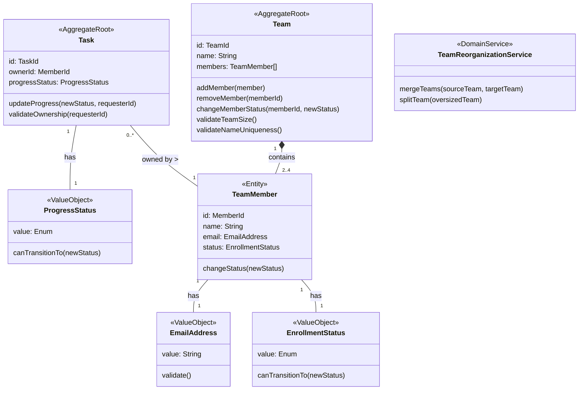
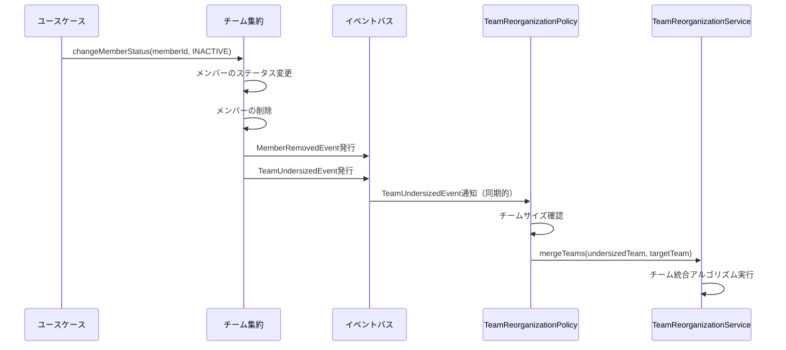

# システムパターン

## アーキテクチャ概要

このプロジェクトはオニオンアーキテクチャに準拠しており、以下の層で構成されています：

1. **ドメイン層**：ビジネスロジックの中核
2. **アプリケーション層**：ユースケースの実装
3. **インフラストラクチャ層**：外部システムとの連携
4. **プレゼンテーション層**：API エンドポイントの提供

各層は内側の層にのみ依存し、外側の層への依存は持ちません。これにより、ドメインロジックを外部の技術的な詳細から分離し、テスト容易性と保守性を高めています。

## ドメインモデル設計

### 集約（Aggregate）

ドメインモデルは以下の 2 つの集約で構成されています：

#### 1. チーム集約（Team Aggregate）

- **集約ルート**: Team
- **エンティティ**: TeamMember（参加者情報）
- **値オブジェクト**: EmailAddress, EnrollmentStatus
- **責務**:
  - チーム情報の管理
  - チームメンバーの管理（追加・削除）
  - メンバーの在籍状態管理
  - チームサイズの制約適用

#### 2. 課題集約（Task Aggregate）

- **集約ルート**: Task
- **値オブジェクト**: ProgressStatus
- **責務**:
  - 課題の進捗管理
  - 進捗ステータスの遷移ルールの適用
  - 所有者確認のための参照

### 集約間の関係

## ドメインサービス

複雑なビジネスロジックを実装するために、最小限のドメインサービスを導入しています：

### チーム再編サービス（TeamReorganizationService）

- 複雑なチーム統合アルゴリズムの実装
- 複雑なチーム分割アルゴリズムの実装

これらは複雑なアルゴリズムを含むため、集約内に実装するよりもドメインサービスとして分離しています。

## ドメインイベント

集約間の疎結合な連携を実現するために、ドメインイベントを活用しています。ドメインイベントは基底クラス（DomainEvent）を継承し、イベント ID と発生日時を持ちます。イベントの発行と購読は DomainEventBus を通じて行われます。

### チーム集約から発行されるイベント（実装済み）

- **TeamCreatedEvent**: チーム作成時
- **MemberAddedEvent**: メンバー追加時
- **MemberRemovedEvent**: メンバー削除時
- **MemberStatusChangedEvent**: メンバーの在籍状態変更時
- **TeamUndersizedEvent**: チームサイズが 2 名未満になった時
- **TeamOversizedEvent**: チームサイズが 4 名を超えた時

### 課題集約から発行されるイベント（実装済み）

- **TaskCreatedEvent**: 課題作成時
- **TaskProgressChangedEvent**: 課題進捗更新時

### イベント処理の実装

ドメインイベントの処理は同期的に行われます。これは現在のプロジェクト規模では十分であり、シンプルさと即時整合性を重視しています。

イベントハンドラ内でのエラーは、try-catch ブロックで捕捉され、エラーログが記録されます。将来的にはより堅牢なエラーハンドリングの仕組みを導入する可能性があります。

## アプリケーション層のポリシー

ドメインサービスを減らす代わりに、アプリケーション層にポリシーを導入しています：

### TeamReorganizationPolicy（実装済み）

- イベント購読：TeamUndersizedEvent, TeamOversizedEvent
- 責務：チームサイズの変更に応じたチーム再編処理の調整
- 主要処理：
  - チーム統合（1 名のチームを他のチームに統合）
  - チーム分割（5 名以上のチームを 2 つに分割）
  - 管理者への通知（TODO）

### TaskManagementPolicy（未実装）

- イベント購読：MemberStatusChangedEvent, MemberRemovedEvent
- 責務：参加者の状態変更に伴う課題の処理
- 主要処理：
  - 非アクティブになった参加者の課題の処理

## リポジトリパターン

各集約ルートに対応するリポジトリを定義し、永続化の詳細を抽象化しています：

1. **TeamRepository**: チームの永続化と検索
2. **TaskRepository**: 課題の永続化と検索

## 値オブジェクト

不変で値に基づく同一性を持つ値オブジェクトを活用しています：

1. **EmailAddress**: メールアドレスのバリデーションと値の保持
2. **EnrollmentStatus**: 在籍状態の値と遷移ルールの管理
3. **ProgressStatus**: 進捗状態の値と遷移ルールの管理

## 実装上の考慮点

1. **トランザクション管理**:

   - 集約内の一貫性はトランザクションで保証
   - 集約間の一貫性はイベント駆動で結果整合性を実現

2. **イベント処理**:

   - 現在は同期的なイベント処理を採用（シンプルさと即時整合性を重視）
   - イベントハンドラ内でのエラーは元の操作に影響しないよう分離
   - 将来的な要件変更に応じて非同期処理への移行も検討可能

3. **副作用の分離**:

   - メール通知などの副作用はポリシー内で明示的に分離
   - 現在はログ出力のみ実装、将来的に実際の通知機能を追加予定

4. **集約間の参照**:
   - 集約間の参照は ID のみを使用
   - 必要に応じてリポジトリから関連する集約を取得
