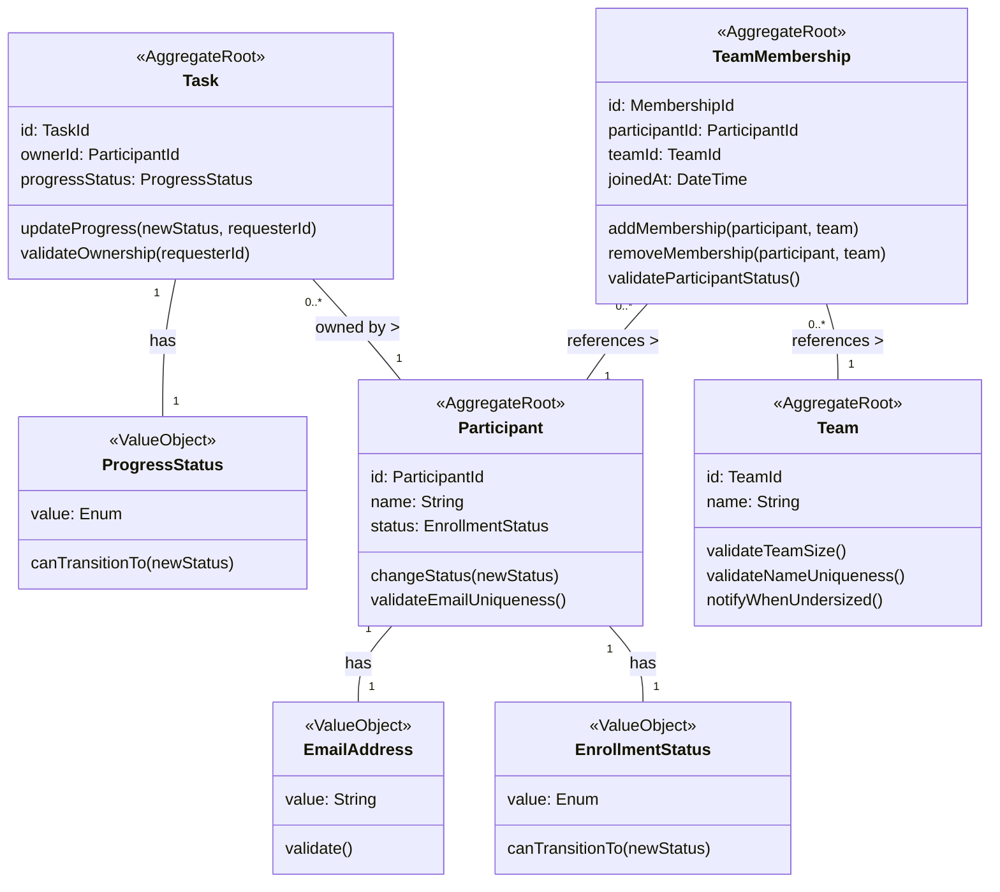

# システムパターン

## アーキテクチャ概要

このプロジェクトはオニオンアーキテクチャに準拠しており、以下の層で構成されています：

1. **ドメイン層**：ビジネスロジックの中核
2. **アプリケーション層**：ユースケースの実装
3. **インフラストラクチャ層**：外部システムとの連携
4. **プレゼンテーション層**：APIエンドポイントの提供

各層は内側の層にのみ依存し、外側の層への依存は持ちません。これにより、ドメインロジックを外部の技術的な詳細から分離し、テスト容易性と保守性を高めています。

## ドメインモデル設計

### 集約（Aggregate）

ドメインモデルは以下の4つの集約で構成されています：

#### 1. 参加者集約（Participant Aggregate）
- **集約ルート**: Participant
- **値オブジェクト**: EmailAddress, EnrollmentStatus
- **責務**:
  - 参加者の基本情報管理
  - 在籍ステータスの整合性確保
  - メールアドレスの一意性保証

#### 2. 課題集約（Task Aggregate）
- **集約ルート**: Task
- **値オブジェクト**: ProgressStatus
- **責務**:
  - 課題の進捗管理
  - 進捗ステータスの遷移ルールの適用
  - 所有者確認のための参照

#### 3. チーム集約（Team Aggregate）
- **集約ルート**: Team
- **責務**:
  - チーム名の一意性確保
  - チームサイズの検証

#### 4. チームメンバーシップ集約（TeamMembership Aggregate）
- **集約ルート**: TeamMembership
- **責務**:
  - 参加者とチームの関連付け管理
  - 在籍中の参加者のみチームに所属できるルールの適用
  - メンバーシップの作成・削除

### 集約間の関係



## ドメインサービス

集約間の連携や複雑なビジネスロジックを実装するために、以下のドメインサービスを導入しています：

### 1. チーム再編サービス（TeamReorganizationService）
- チームの過不足発生時の再編ロジック
- 最適なチーム配属先の決定アルゴリズム
- チーム分割・統合処理の調整

### 2. 参加者管理サービス（ParticipantManagementService）
- 参加者の在籍状態変更に伴う横断的処理
- 追加・休会・退会時の一連の操作の調整
- メール通知の発行

### 3. 課題管理サービス（TaskManagementService）
- 課題の割り当てと進捗更新の調整
- 参加者と課題間の権限確認
- 進捗状況の集計と分析

## ドメインイベント

集約間の疎結合な連携を実現するために、以下のドメインイベントを使用しています：

### 主要なドメインイベント
1. **ParticipantStatusChangedEvent**: 参加者の在籍状態が変更された
2. **TeamMembershipRemovedEvent**: チームメンバーシップが削除された
3. **TeamUndersizedEvent**: チームの人数が不足した
4. **TeamOversizedEvent**: チームの人数が超過した
5. **TaskProgressUpdatedEvent**: 課題の進捗状態が更新された

### イベント処理フロー例

```
[参加者集約] → ParticipantStatusChangedEvent → 
[チームメンバーシップハンドラー] → MembershipRemovedEvent →
[チーム再編サービス] → TeamUndersizedEvent →
[チーム再編サービス] → TeamMergedEvent →
[通知サービス]
```

## リポジトリパターン

各集約ルートに対応するリポジトリを定義し、永続化の詳細を抽象化しています：

1. **ParticipantRepository**: 参加者の永続化と検索
2. **TaskRepository**: 課題の永続化と検索
3. **TeamRepository**: チームの永続化と検索
4. **TeamMembershipRepository**: チームメンバーシップの永続化と検索

## 値オブジェクト

不変で値に基づく同一性を持つ値オブジェクトを活用しています：

1. **EmailAddress**: メールアドレスのバリデーションと値の保持
2. **EnrollmentStatus**: 在籍状態の値と遷移ルールの管理
3. **ProgressStatus**: 進捗状態の値と遷移ルールの管理

## 実装上の考慮点

1. **トランザクション管理**:
   - 集約内の一貫性はトランザクションで保証
   - 集約間の一貫性は結果整合性（Eventually Consistent）で実現

2. **イベントの永続化**:
   - 重要なドメインイベントは監査目的で永続化
   - 障害発生時の再処理のための履歴保持

3. **非同期処理**:
   - メール通知などの副作用は非同期で実行
   - イベント処理の順序と整合性の確保
