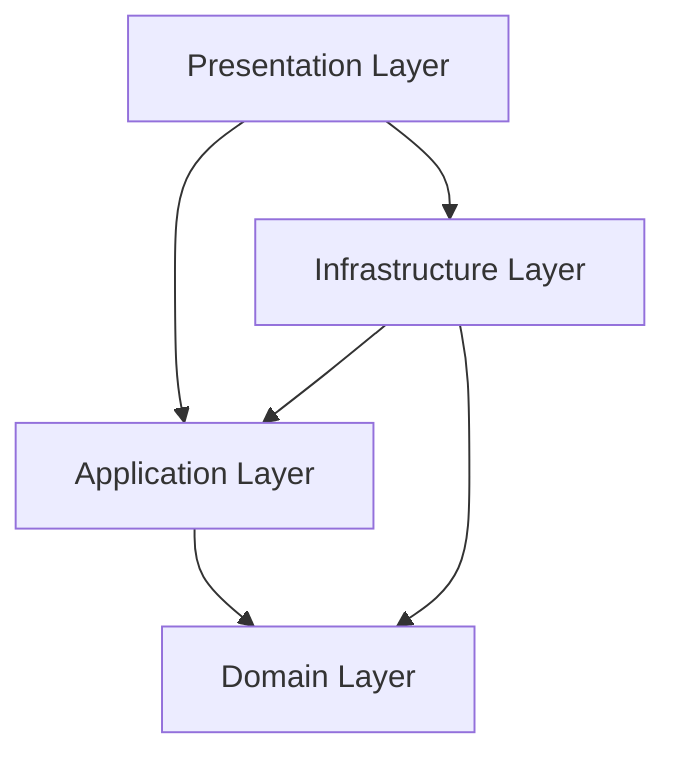

# 技術コンテキスト

## 開発環境

### 言語とランタイム
- **言語**: TypeScript
- **ランタイム**: Node.js
- **パッケージマネージャー**: pnpm

### 開発ツール
- **リンター/フォーマッター**: Biome
- **テストフレームワーク**: Vitest
- **ビルドツール**: Vite
- **型チェック**: TypeScript

### データベース
- **RDBMS**: PostgreSQL
- **ORM**: Drizzle
- **マイグレーション**: Drizzle Kit

## 主要な依存関係

### フレームワーク
- **Hono**: 軽量なWebフレームワーク
  - APIエンドポイントの実装
  - ミドルウェアによるリクエスト処理
  - バリデーション統合

### ユーティリティライブラリ
- **Zod**: スキーマバリデーション
  - 入力値の検証
  - 型安全性の確保
- **ULID**: ID生成
  - ソート可能なユニークID
  - 時間順序の保証

### インフラストラクチャ
- **Docker**: コンテナ化
  - PostgreSQLの実行環境
  - 開発環境の一貫性確保

## アーキテクチャの実装

### ディレクトリ構造
```
src/
├── domain/             # ドメイン層
│   ├── participant/    # 参加者集約
│   ├── task/           # 課題集約
│   ├── team/           # チーム集約
│   └── membership/     # チームメンバーシップ集約
├── application/        # アプリケーション層
│   ├── use-case/       # ユースケース
│   └── query-service/  # クエリサービス
├── infrastructure/     # インフラストラクチャ層
│   ├── repository/     # リポジトリ実装
│   └── query-service/  # クエリサービス実装
├── presentation/       # プレゼンテーション層
│   └── task/           # タスク関連コントローラー
└── libs/               # 共通ライブラリ
    ├── drizzle/        # Drizzle関連
    └── ulid/           # ULID関連
```

### レイヤー間の依存関係



## ドメイン層の実装

### エンティティと値オブジェクト

```typescript
// 値オブジェクトの例（EmailAddress）
export class EmailAddress {
  private readonly value: string;

  private constructor(value: string) {
    this.value = value;
  }

  public static create(value: string): Result<EmailAddress, Error> {
    // バリデーションロジック
    if (!value.includes('@')) {
      return err(new Error('Invalid email format'));
    }
    return ok(new EmailAddress(value));
  }

  public getValue(): string {
    return this.value;
  }

  public equals(other: EmailAddress): boolean {
    return this.value === other.value;
  }
}

// エンティティの例（Participant）
export class Participant {
  private readonly id: string;
  private readonly name: string;
  private readonly email: EmailAddress;
  private status: EnrollmentStatus;

  private constructor(props: {
    id: string;
    name: string;
    email: EmailAddress;
    status: EnrollmentStatus;
  }) {
    this.id = props.id;
    this.name = props.name;
    this.email = props.email;
    this.status = props.status;
  }

  public static create(props: {
    name: string;
    email: string;
  }): Result<Participant, Error> {
    const emailResult = EmailAddress.create(props.email);
    if (!emailResult.ok) {
      return err(emailResult.error);
    }

    return ok(
      new Participant({
        id: ulid(),
        name: props.name,
        email: emailResult.value,
        status: EnrollmentStatus.ACTIVE,
      })
    );
  }

  // メソッド...
}
```

### リポジトリインターフェース

```typescript
// リポジトリインターフェースの例
export interface ParticipantRepository {
  save(participant: Participant): Promise<void>;
  findById(id: string): Promise<Participant | undefined>;
  findByEmail(email: EmailAddress): Promise<Participant | undefined>;
  findAll(): Promise<Participant[]>;
}
```

## アプリケーション層の実装

### ユースケース

```typescript
// ユースケースの例
export class CreateParticipantUseCase {
  constructor(private participantRepository: ParticipantRepository) {}

  async execute(input: {
    name: string;
    email: string;
  }): Promise<Result<ParticipantDTO, Error>> {
    // 1. メールアドレスの重複チェック
    const emailResult = EmailAddress.create(input.email);
    if (!emailResult.ok) {
      return err(emailResult.error);
    }

    const existingParticipant = await this.participantRepository.findByEmail(
      emailResult.value
    );
    if (existingParticipant) {
      return err(new Error('Email already exists'));
    }

    // 2. 参加者の作成
    const participantResult = Participant.create({
      name: input.name,
      email: input.email,
    });
    if (!participantResult.ok) {
      return err(participantResult.error);
    }

    // 3. 参加者の保存
    await this.participantRepository.save(participantResult.value);

    // 4. DTOの返却
    return ok({
      id: participantResult.value.getId(),
      name: participantResult.value.getName(),
      email: participantResult.value.getEmail().getValue(),
      status: participantResult.value.getStatus().getValue(),
    });
  }
}
```

## インフラストラクチャ層の実装

### リポジトリ実装

```typescript
// リポジトリ実装の例
export class PostgresqlParticipantRepository implements ParticipantRepository {
  constructor(private readonly database: Database) {}

  async save(participant: Participant): Promise<void> {
    await this.database
      .insert(participants)
      .values({
        id: participant.getId(),
        name: participant.getName(),
        email: participant.getEmail().getValue(),
        status: participant.getStatus().getValue(),
      })
      .onConflictDoUpdate({
        target: participants.id,
        set: {
          name: sql.raw(`excluded.${participants.name.name}`),
          email: sql.raw(`excluded.${participants.email.name}`),
          status: sql.raw(`excluded.${participants.status.name}`),
        },
      });
  }

  // 他のメソッド...
}
```

## プレゼンテーション層の実装

### コントローラー

```typescript
// コントローラーの例
export const createParticipantController = new Hono<Env>();

createParticipantController.post(
  '/participants/new',
  zValidator(
    'json',
    z.object({
      name: z.string().min(1),
      email: z.string().email(),
    })
  ),
  createMiddleware<Env>(async (context, next) => {
    const database = getDatabase();
    const participantRepository = new PostgresqlParticipantRepository(database);
    const createParticipantUseCase = new CreateParticipantUseCase(
      participantRepository
    );
    context.set('createParticipantUseCase', createParticipantUseCase);

    await next();
  }),
  async (context) => {
    const body = context.req.valid('json');

    const result = await context.var.createParticipantUseCase.execute(body);
    if (!result.ok) {
      return context.json({ error: result.error.message }, 400);
    }

    return context.json(result.value, 201);
  }
);
```

## 開発セットアップ

### 環境構築手順

1. リポジトリのクローン
   ```bash
   git clone <repository-url>
   cd praha-challenge-ddd-template
   ```

2. 依存関係のインストール
   ```bash
   pnpm install
   ```

3. 環境変数の設定
   ```bash
   cp .env.example .env
   # .envファイルを編集
   ```

4. データベースの起動
   ```bash
   docker compose up -d
   ```

5. マイグレーションの実行
   ```bash
   pnpm run migration:apply
   ```

6. 開発サーバーの起動
   ```bash
   pnpm run dev
   ```

### 開発コマンド

- **開発サーバー起動**: `pnpm run dev`
- **ビルド**: `pnpm run build`
- **本番サーバー起動**: `pnpm run start`
- **テスト実行**: `pnpm run test`
- **リント/フォーマット**: `pnpm run lint`
- **マイグレーション生成**: `pnpm run migration:generate`
- **マイグレーション適用**: `pnpm run migration:apply`
- **マイグレーション削除**: `pnpm run migration:drop`

## 技術的制約と考慮事項

1. **Value Objectの実装**
   - 現状のテンプレートではValue Objectが十分に実装されていない
   - 今後の実装では、プリミティブ型をラップした値オブジェクトを導入する必要がある

2. **Nominal Typing**
   - TypeScriptの構造的型システムでは、同じプロパティを持つ型が等価になってしまう
   - ブランド型や独自の型ガードを使用して名目的型付けを実現する必要がある

3. **トランザクション管理**
   - 集約をまたぐ操作では、トランザクション管理が必要
   - Drizzleのトランザクションサポートを活用する

4. **非同期処理**
   - イベント駆動アーキテクチャの実装には、非同期処理の仕組みが必要
   - 現状では単純なイベントエミッターを使用しているが、より堅牢な仕組みを検討する
